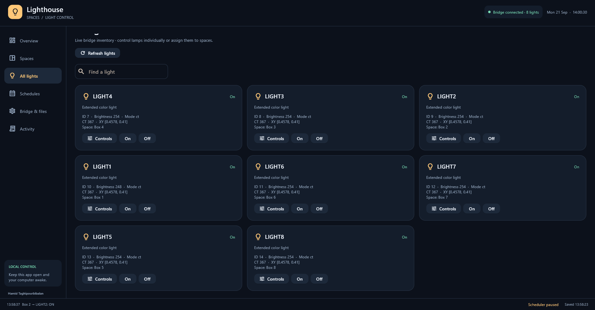
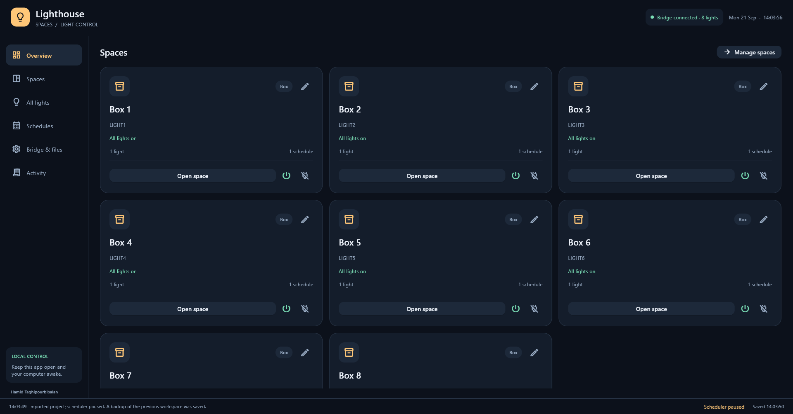
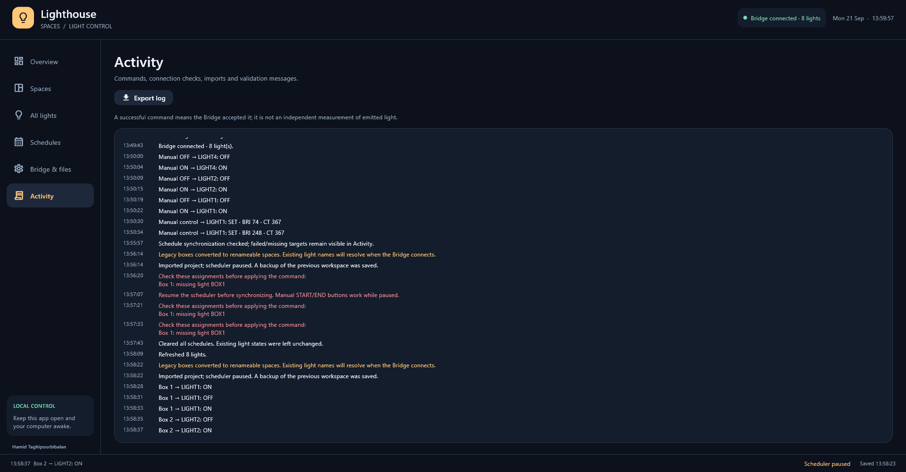

# lighthouse 💡
[This repository is under construction 🏗️🚧🏗️🚧👷🏻‍♂️]
Lighthouse is a python GUI to control philips lights. 

### Hardware Requirements

| Component | Purpose |
|---|---|
| **Philips Hue lights** | Provide the programmable experimental illumination, light bulbs, strips and such |
| **Philips Hue Bridge** | Controls the Hue lights and provides access to them over the local network |
| **LAN router** | Creates the local network connecting the Hue Bridge and control computer |
| **A Computer** | Runs the Lighthouse software and sends commands to the Hue Bridge |

### Network Setup

The system can operate entirely on a **local network (LAN)** and does not require an active Internet connection during normal operation.
Connect the system as follows:
**Computer ⇆ LAN Router ⇆ Philips Hue Bridge ⇆ Hue Lights**
The computer and Hue Bridge must be connected to the **same local network** so that the Lighthouse software can communicate with the Bridge.

## Overview

The Lighthouse scheduler allows Philips Hue lights be controlled and scheduled via the Hue Bridge.
A schedule consists of:
* Start State
* End State
* Start Time
* End Time
* Recurrence Pattern
* Assigned Boxes ( Box is any separate compartment, e.g. a room or an experimental chamber)

### Understanding "Actions"

| Action | What it does | Colour | Example | When to use |
|---|---|---|---|---|
| **`OFF`** | Turns the light completely off | --- | `Action = OFF` | When the light should be off |
| **`ON`** | Turns the light on and can set brightness | **Does not change colour** | `Action = ON` · `Brightness = 100` | When colour does not matter or is already set |
| **`SET`** | Applies a complete light state | **Can change colour** | `Action = SET` · `Preset = RED` · `Brightness = 40` | **Recommended whenever colour matters** |

### What can `SET` control?

`SET` can apply **brightness, colour, colour temperature, XY colour coordinates, and wavelength**.

> **Important:** `ON` does not set the colour. The light may retain its previous colour. Use `SET` whenever a specific colour is required.

### Recommended Rule

> **If your protocol uses different colours, always use `SET`.**

For example, for **White Day → Red Night**:

| Time | Correct | Incorrect |
|---|---|---|
| **06:00** | `SET White · BRI 100` | `ON · BRI 100` |
| **18:00** | `SET Red · BRI 40` | `ON · Red · BRI 40` |

With `ON`, the requested colour may not be applied. Use `SET` whenever the protocol requires a specific colour.

### Recurrence Types

| Recurrence | Behaviour | Example |
|---|-----|----|
| **Once** | Runs on a single day only | 15/06/2026 · 06:00 → 18:00 |
| **Daily** | Repeats every day within the selected date range | 15/06/2026 → 22/06/2026 · 06:00 → 18:00 |
| **Weekly** | Runs only on selected weekdays | Monday · Wednesday · Friday |

### Until Date

The **Until Date is inclusive**: the schedule remains active through the selected date.

**Example:**  
`Start Date: 15/06/2026` · `Until Date: 21/06/2026`

The final scheduled event occurs on **21/06/2026**. No new events are created for **22/06/2026**.

> **Practical example:** If an experiment finishes at 06:00 but the animals will not be removed until 08:00, set the **Until Date** so that a new light cycle does not begin while the animals are waiting to be removed.

### Common Experimental Protocols

| Protocol | Day | Night |
|---|---|---|
| **Standard Light/Dark (LD)** | 06:00 · White · BRI 100 | 18:00 · OFF |
| **White Day / Red Night** | 06:00 · Warm · BRI 100 | 18:00 · Red · BRI 40 |
| **Red Day / Dark Night** | 06:00 · Red · BRI 40 | 18:00 · OFF |
| **Constant Darkness (DD)** | Red · BRI 1, or OFF | -- |
| **Constant Light (LL)** | Warm · BRI 100 | -- |

**LD:** 12 h light / 12 h dark.  
**DD:** Lights remain off (or at minimal red illumination).  
**LL:** Lights remain on continuously.

### Example: Two Experimental Groups

| Schedule | Boxes | Day | Night |
|---|---|---|---|
| **A** | 1--4 | Warm · BRI 100 | Red · BRI 40 |
| **B** | 5--8 | Red · BRI 40 | OFF |

Each schedule controls only its assigned boxes.

### Scheduler behaviour after restart

The scheduler automatically attempts to restore the correct state when:

* the GUI restarts
* the bridge reconnects
* a configuration file is loaded

Therefore it is generally safe to restart Lighthouse during long experiments.

### Common Mistakes

| Mistake | Problem | Solution |
|---|---|---|
| **Using `ON` instead of `SET`** | Colour never changes | Use `SET` whenever colour is important |
| **Wrong Until Date** | Lights continue longer than expected | Check the **Until Date** carefully |
| **Assigning the wrong lights** | Schedule runs correctly but controls the wrong box | Verify **Box → Light** assignments before starting an experiment |

### Best Practice

For behavioural and circadian experiments:

* Use SET for all colour transitions.
* Save a JSON backup before starting.

* Verify the the light and colour transitions before leaving the experiment unattended ( Manually change date/time on the computer)
* Keep a written record of the protocol used in each experiment.

## to do ⚙️

**Add instructions for pairing Hue bridge and the Lighthouse**

**explain the working of the json file - syntax**

**add conda env installation guides**

**create .exe setup file**

